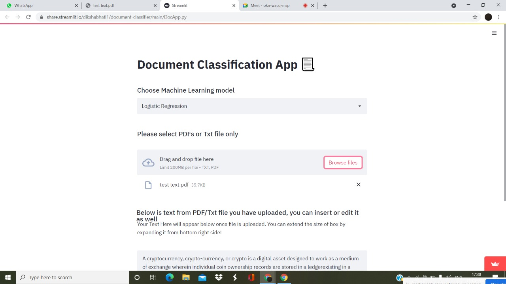
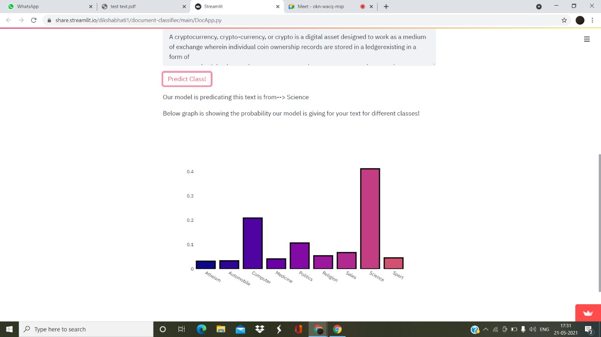
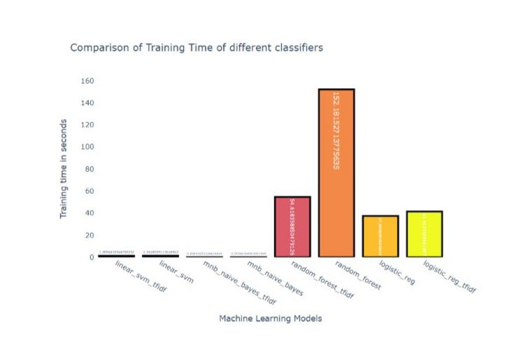
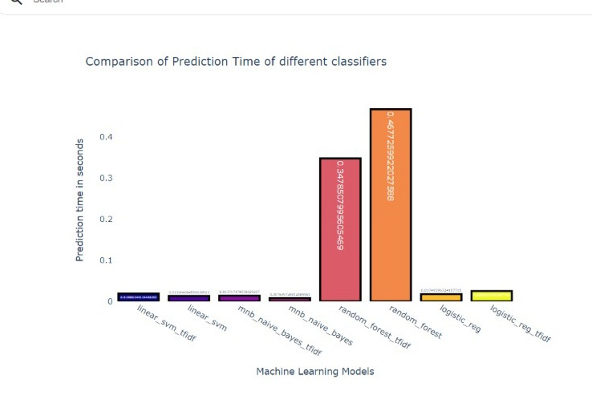
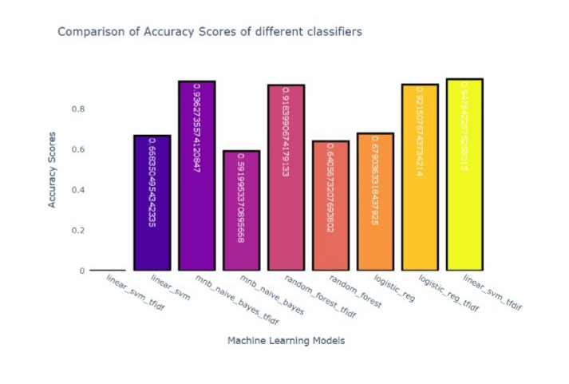

# Document-Classifier

# Overview
Document classification or document categorization is a problem in library science, information science and computer science. The task is to assign a document to one or more classes or categories.In this problem I have trained multiple ml models,LSTM and BERT.This document classification app will able to classify the documents into 9 categories.The 9 categories are:
- computer
- science
- politics
- sport
- automobile
- religion
- medicine
- sales
- alt.atheism

# Demo
Made a streamlit web app.Here is the link for the application : https://share.streamlit.io/dikshabhati1/document-classifier/main/DocApp.py 
Demo for the app 
 
 

 
 

# Models
Models trained are:
- Random Forest
- Mulitnomial Naive Bayes
- Logistic Regression
- Support Vector Machine
- LSTM
- BERT

# Training Time

# Prediction Time

# Accuracy

